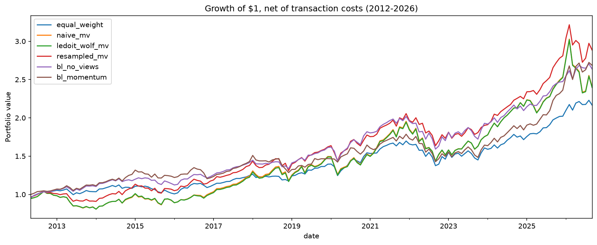
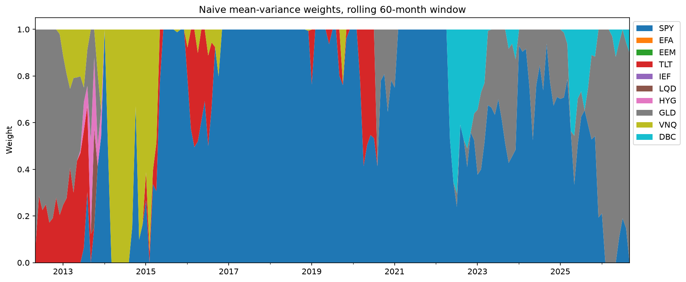

# Portfolio Optimization Under Parameter Uncertainty

Here's the problem with classic portfolio optimization. Mean variance optimization asks you for expected returns, then treats your guesses as if they were facts. Feed it a few lucky years for one asset and it will happily pour most of your money into it. That's why it gets called an "error maximizer."

This project puts that reputation to the test on real data. It pits naive optimization against three approaches that take estimation error seriously (shrinkage, resampling, and Black-Litterman), plus simple equal weighting, and asks a straightforward question: do the smarter methods actually build better portfolios out of sample?

Short answer: yes, they help. But the evidence is shakier than the headline numbers make it look, and a lot of what looks like a method working turns out to be an assumption doing the heavy lifting.

## So what happened?

Naive optimization lived up to its reputation. Looking back over five years of data each month, it held the equivalent of just 1.55 funds out of 10, often going all in on a single one, and it kept chasing whatever had done best recently. Out of sample, it had the worst risk adjusted performance of the six strategies.

Cleaning up the covariance estimate with Ledoit and Wolf shrinkage barely made a difference. The weights, the trading, and the returns came out almost identical. That lines up with a classic result from Chopra and Ziemba (1993): mistakes in expected returns hurt far more than mistakes in the covariance matrix. If you want a more stable portfolio, the expected returns are what need fixing.

The methods that go after expected returns directly, resampling and Black-Litterman, did better. All of them beat naive optimization on Sharpe ratio, in every single setup tested.

With about 14 years of monthly data to judge them on, only resampling's edge over naive optimization stood out from the noise, and even that was fragile. And Black-Litterman's win over equal weighting came mostly from its starting assumptions, which happened to lean toward US stocks during a stretch when US stocks beat almost everything else.

## The numbers

Each month from May 2012 to September 2026 (173 months), every strategy picks its weights using only the previous 60 months of data, holds them for a month, and pays 10 basis points on whatever it trades:

| Strategy | Annual return | Volatility | Sharpe | Worst drawdown | Monthly turnover | Effective # of funds |
|---|---|---|---|---|---|---|
| Equal weight (1/N) | 5.5% | 8.6% | 0.472 | 19.0% | 0.02 | 10.0 |
| Naive mean variance | 6.3% | 13.3% | 0.401 | 26.6% | 0.24 | 1.6 |
| Shrinkage (Ledoit and Wolf) | 6.2% | 13.3% | 0.397 | 26.2% | 0.24 | 1.6 |
| Resampling | 7.6% | 10.7% | 0.586 | 20.4% | 0.14 | 2.9 |
| Black-Litterman, no views | 7.0% | 9.1% | 0.605 | 21.1% | 0.02 | 7.3 |
| Black-Litterman, momentum views | 7.1% | 9.5% | 0.595 | 20.1% | 0.33 | 5.0 |

That chart is the "error maximizer" problem in a single picture. Watch the naive portfolio jump from one big bet to the next, piling into commodities right after their 2021 to 2022 surge, then into gold right after its big rally.

## But is any of this real?

A difference in Sharpe ratio doesn't mean much on its own, so the project bootstraps it. That means rebuilding the return history thousands of times by stitching together random chunks of real months (5,000 times, with chunks averaging six months long), then checking how often each strategy comes out ahead. Every strategy gets the same months in each rebuild, so the fact that they tend to rise and fall together stays intact.

Resampling beat naive optimization by 0.18, with a 95% interval running from 0.008 to 0.348. That makes it the only strategy that clearly beat naive, and only just. Make the chunks a year long instead and the bottom of that interval lands right on zero. Black-Litterman with no views beat equal weighting by 0.13 (interval 0.028 to 0.257), and that one held up no matter how long the chunks were. Every other comparison, including Black-Litterman against naive optimization, couldn't be told apart from noise.

Black-Litterman actually had a bigger lead over naive optimization than resampling did, yet its interval was much wider. Why? Resampling starts from the same estimates as naive optimization, so the two portfolios move together and their difference is easy to measure. Black-Litterman holds completely different portfolios, so its difference from naive is much noisier. Comparing similar strategies gives you sharp answers. Comparing very different ones needs a lot more than 14 years of data.

Around ten comparisons were made here, so one borderline "win" could easily be a fluke.

## How much does it depend on the settings?

**Trading costs.** Before costs, Black-Litterman with momentum views was actually the best strategy of all, with a Sharpe of 0.638. The catch is that it trades a lot. Its advantage vanished once costs reached about 7 or 8 basis points, and at 50 basis points it sank to 0.424.

**Black-Litterman's dials.** The original plan was to test how much the parameter τ matters. Turns out it doesn't matter at all here. With the standard He and Litterman setup, τ appears on both sides of the formula and cancels out completely, and a numerical check confirmed it: switching τ from 0.025 to 0.10 changed the expected returns by exactly zero. The dials that actually matter are how big the view is and how much you trust it. Across nine combinations, bolder views kept making things worse, with lower Sharpe ratios and more trading, pushing the portfolio back toward the concentrated mess Black-Litterman is supposed to prevent. One mild setting did beat the original choice, but switching to it after seeing the results would be cheating, so the original stays as the headline.

**Risk aversion and lookback.** Doubling risk aversion (δ from 2.5 to 5) lifted naive optimization from 0.401 to 0.525, enough to beat equal weighting. So the famous finding that naive optimization loses to equal weighting holds at one level of risk aversion and flips at another. Cutting the lookback window from five years to three hurt resampling the most, dropping it from 0.586 to 0.506. Through all of it, resampling and Black-Litterman with no views still beat naive optimization.

**The starting weights.** Black-Litterman's results rose and fell with how much its starting portfolio leaned on US stocks: 0.472 starting from equal weights, 0.605 from the baseline market weights, and 0.660 from a classic 60/40 split. That's strong evidence that its win over equal weighting says more about this period's winners than about the method. Interestingly, the momentum view helped when the starting weights were poor and hurt when they were already good.

## The data

Ten ETFs covering the main asset classes, with monthly returns from May 2007 (when HYG, the youngest fund, launched) through September 2026:

| ETF | What it holds | Assumed market weight |
|---|---|---|
| SPY | US stocks | 25% |
| EFA | Developed market stocks outside the US | 15% |
| EEM | Emerging market stocks | 7% |
| IEF | Medium term Treasuries | 12% |
| TLT | Long term Treasuries | 8% |
| LQD | Investment grade corporate bonds | 12% |
| HYG | High yield bonds | 5% |
| GLD | Gold | 6% |
| VNQ | US real estate | 5% |
| DBC | Commodities | 5% |

ETFs don't come with clean market values, so Black-Litterman's starting point is an approximate global market portfolio: roughly 47% stocks, 37% bonds, and 16% real assets, locked in before any backtest was run. The risk free rate comes from the three month Treasury bill, lagged by a month so each month only uses the rate you'd actually have known at the time. Returns are simple percentage returns rather than log returns, because a portfolio's return is just the weighted sum of its funds' simple returns.

## How each strategy works

**The shared goal.** Every optimized strategy tries to maximize expected return minus a penalty for risk (half of δ times the portfolio's variance), with no short selling and all money invested, using δ = 2.5. The only thing that changes from one strategy to the next is how expected returns and risk get estimated, which keeps the comparison fair.

**Equal weight.** 10% in every fund, rebalanced monthly. Simple, and surprisingly hard to beat.

**Naive mean variance.** Plug in the average returns and covariance from the last 60 months and let the optimizer go.

**Shrinkage (Ledoit and Wolf).** Same average returns, but the covariance gets pulled toward a simpler, more stable structure. On average it moved about 12% of the way.

**Resampling.** Simulate 500 alternative versions of the last five years that are consistent with the estimates, optimize each one, and average the results. A fund that only looked great because of one lucky history gets watered down. Going from 200 to 500 simulations shifted weights by up to 3.3 percentage points, so 500 it is.

**Black-Litterman.** Instead of trusting past averages, start from the returns the market weights themselves imply, then blend in views. The momentum view says the three funds with the best past year will beat the three worst by 3% a year. Following He and Litterman, the view and the starting point are treated as equally trustworthy, so the result lands halfway between them. The whole model was written from scratch and checked against PyPortfolioOpt, and the numbers matched exactly.

**The backtest.** Each month, every strategy sees only the past 60 months, picks its weights, and holds them for a month. Weights drift with prices between rebalances, and every trade costs 10 basis points.

## What to keep in mind

Fourteen years of data simply isn't enough to separate strategies with similar Sharpe ratios. The period was also dominated by US stocks, which flatters anything that leaned that way. The market weights are rough and stay fixed the whole time, and counting gold and commodities as part of a "market portfolio" is a judgment call. Resampling assumes returns follow a normal distribution, which understates how wild the extremes can get. The cost model is simple and ignores the price impact of big trades. And only one view rule was tested.

## What's in the repo

    notebooks/
      01_data_prep.ipynb        monthly returns, risk free rate, summary stats
      02_strategy_setup.ipynb   building and checking each strategy
      03_backtest.ipynb         the backtest and sensitivity tests
      04_uncertainty.ipynb      bootstrap confidence intervals
    src/
      download_data.py          downloads ETF prices and Treasury bill yields
      portfolio.py              the optimizer and all six strategies
      backtest.py               the backtest engine and performance metrics
    figures/                    charts used in this README
    data/                       not tracked in git; rebuild it with src/download_data.py

## Try it yourself

    git clone https://github.com/EthanB425/Portfolio-Optimization-Under-Uncertainty.git
    cd Portfolio-Optimization-Under-Uncertainty
    python -m venv venv
    source venv/bin/activate      # on Windows: venv\Scripts\Activate.ps1
    pip install -r requirements.txt
    python src/download_data.py

Then run the notebooks in order, 01 to 04. The main backtest takes a couple of minutes (resampling is the slow part), and the sensitivity tests add about ten more.

## Further reading

1. Chopra and Ziemba (1993), on how errors in expected returns damage optimized portfolios
2. DeMiguel, Garlappi and Uppal (2009), on why equal weighting is so hard to beat
3. He and Litterman (1999), on the intuition behind Black-Litterman
4. Idzorek (2005), a practical guide to Black-Litterman
5. Ledoit and Wolf (2004), on covariance shrinkage
6. Michaud (1998), on resampled efficiency
7. Politis and Romano (1994), on the stationary bootstrap
8. Scherer (2002), a critique of resampling

## License

MIT
